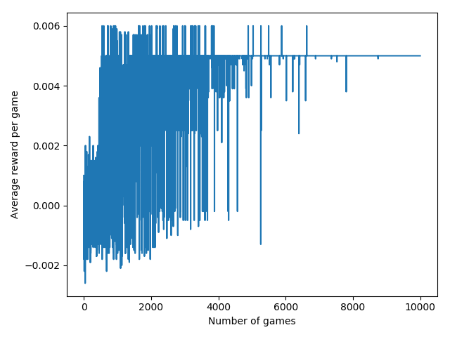

# Strategies in RL for trading

18jul2019
After training for 10.000 epochs, with an initial budget of 1100€, the system stabilized and found an optimal strategy to apply:

	Strategies learned
	--------------------------------------
	State EVEN_EVEN_HAVE     -> buy        
	State EVEN_EVEN_DONTHAVE -> buy        
	State EVEN_WIN_HAVE      -> buy        
	State EVEN_WIN_DONTHAVE  -> buy        
	State EVEN_LOSE_HAVE     -> buy        
	State EVEN_LOSE_DONTHAVE -> buy        
	State WIN_EVEN_HAVE      -> buy        
	State WIN_EVEN_DONTHAVE  -> buy        
	State WIN_WIN_HAVE       -> buy        
	State WIN_WIN_DONTHAVE   -> buy        
	State WIN_LOSE_HAVE      -> buy        
	State WIN_LOSE_DONTHAVE  -> buy        
	State LOSE_EVEN_HAVE     -> buy        
	State LOSE_EVEN_DONTHAVE -> buy        
	State LOSE_WIN_HAVE      -> do_nothing 
	State LOSE_WIN_DONTHAVE  -> buy        
	State LOSE_LOSE_HAVE     -> sell       
	State LOSE_LOSE_DONTHAVE -> buy        

It seems that optimal is to buy under all circumstances BUT, selling ONLY when I'm loosing money and the forecast indicates that the share price will drop. In addition to this, the trader also recommends to DO_NOTHING when I'm loosing money, and the forecast indicates that the share price will rise.

Surprisingly, the result is optimal, and following this strategy the final outcome is a net gain of 167€ (15,2%).

	 t   |   price | forecast |   budget | net val. |   value | shares | action  | reward   | state               
	----------------------------------------------------------------------------------------------------------------------
	 000 |  1069.2 |   1069.2 |   1100.0 |     -0.0 |     0.0 |    0.0 | +1069.2 | R:  +0.0 | EVEN_EVEN_DONTHAVE
	 001 |  1069.2 |   1132.3 |     30.8 |  -1069.2 |  1069.2 |    1.0 | none    | R:  +0.0 | LOSE_WIN_HAVE
	 002 |  1122.0 |   1123.6 |     30.8 |  -1069.2 |  1122.0 |    1.0 | none    | R:  +0.0 | LOSE_WIN_HAVE
	 003 |  1240.0 |   1122.2 |     30.8 |  -1069.2 |  1240.0 |    1.0 | -1240.0 | R: +10.0 | LOSE_LOSE_HAVE
	 004 |  1232.1 |   1141.8 |   1270.8 |   +170.8 |     0.0 |    0.0 | +1232.1 | R:  +0.0 | WIN_LOSE_DONTHAVE
	 005 |  1274.5 |   1166.0 |     38.7 |  -1061.3 |  1274.5 |    1.0 | -1274.5 | R: +10.0 | LOSE_LOSE_HAVE
	 006 |  1216.2 |   1195.4 |   1313.2 |   +213.2 |     0.0 |    0.0 | +1216.2 | R:  +0.0 | WIN_LOSE_DONTHAVE
	 007 |  1331.8 |   1200.2 |     97.0 |  -1003.0 |  1331.8 |    1.0 | -1331.8 | R: +10.0 | LOSE_LOSE_HAVE
	 008 |  1348.8 |   1235.1 |   1428.8 |   +328.8 |     0.0 |    0.0 | +1348.8 | R:  +0.0 | WIN_LOSE_DONTHAVE
	 009 |  1305.7 |   1276.4 |     79.9 |  -1020.1 |  1305.7 |    1.0 | -1305.7 | R: +10.0 | LOSE_LOSE_HAVE
	 010 |  1327.9 |   1280.3 |   1385.6 |   +285.6 |     0.0 |    0.0 | +1327.9 | R:  +0.0 | WIN_LOSE_DONTHAVE
	 011 |  1284.4 |   1285.2 |     57.7 |  -1042.3 |  1284.4 |    1.0 | none    | R:  +0.0 | LOSE_WIN_HAVE
	 012 |  1168.8 |   1268.4 |     57.7 |  -1042.3 |  1168.8 |    1.0 | none    | R:  +0.0 | LOSE_WIN_HAVE
	 013 |  1159.1 |   1224.2 |     57.7 |  -1042.3 |  1159.1 |    1.0 | none    | R:  +0.0 | LOSE_WIN_HAVE
	 014 |  1210.0 |   1203.9 |     57.7 |  -1042.3 |  1210.0 |    1.0 | -1210.0 | R: +10.0 | LOSE_LOSE_HAVE
	----------------------------------------------------------------------------------------------------------------------
                              1267.7 |    167.7 |     0.0 |    0.0                              
                              
**Remarks** The system is learning over a very limited amount of forecasts: only 14 values. However, the strategy found can be considered optimal, GIVEN the actual rewards schema. You can check the plot of the evolution of average rewards:

## To Do

Test with different reward schemas (grid search?), and much more data to learn from, not only 14 months (values) of Gold Price.
